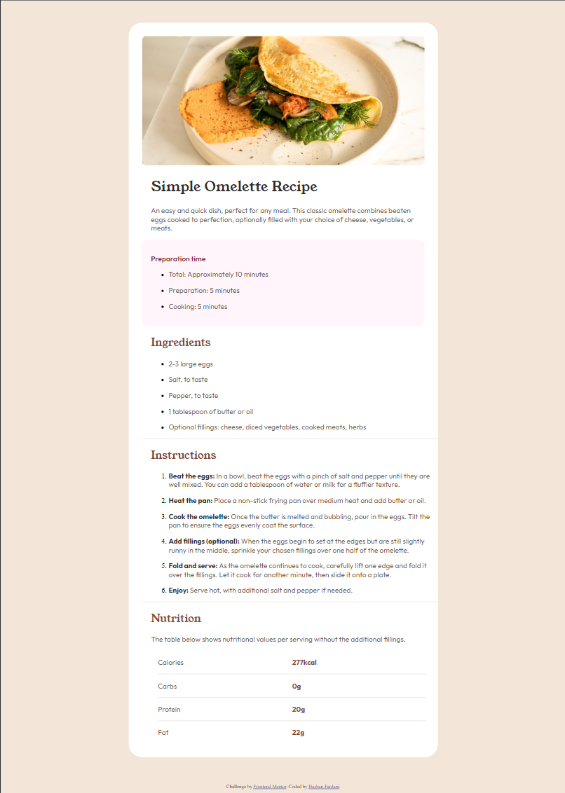

# Frontend Mentor - Recipe page solution

This is a solution to the [Recipe page challenge on Frontend Mentor](https://www.frontendmentor.io/challenges/recipe-page-KiTsR8QQKm). Frontend Mentor challenges help you improve your coding skills by building realistic projects. 

## Table of contents

- [Frontend Mentor - Recipe page solution](#frontend-mentor---recipe-page-solution)
  - [Table of contents](#table-of-contents)
  - [Overview](#overview)
    - [Screenshot](#screenshot)
    - [Links](#links)
  - [My process](#my-process)
    - [Built with](#built-with)
    - [What I learned](#what-i-learned)
    - [Continued development](#continued-development)
    - [Useful resources](#useful-resources)
  - [Author](#author)

**Note: Delete this note and update the table of contents based on what sections you keep.**

## Overview

### Screenshot

### Links

- Solution URL: [Add solution URL here](https://your-solution-url.com)
- Live Site URL: [Add live site URL here](https://your-live-site-url.com)

## My process

### Built with

- Semantic HTML5 markup
- CSS
- Flexbox
- Mobile-first workflow

### What I learned

from this challenge i have learned about how to create a mobile first css with reponsive on desktop using valina CSS and HTML only.

### Continued development

to continue improve my skills and prepare for a champion "LKS Web Technology" i want to focus on create high quality ui/ux and responsive design using vanila css and bootstrap  

### Useful resources

- [stackoverflow](https://stackoverflow.com/) - This helped me a lot to get answer about my stucks.

- [chat GPT](https://chat.openai.com/) - This helped me for asking any question and it usually worked. I use this as my mentor.

## Author

- Website - [Hasban Fardani](https://hasban-fardani.github.io)
- Frontend Mentor - [@Hasban-Fardani](https://www.frontendmentor.io/profile/Hasban-Fardani)
- Linkedin - [@hasban_fardani](https://www.linkedin.com/in/hasban-fardani/)
